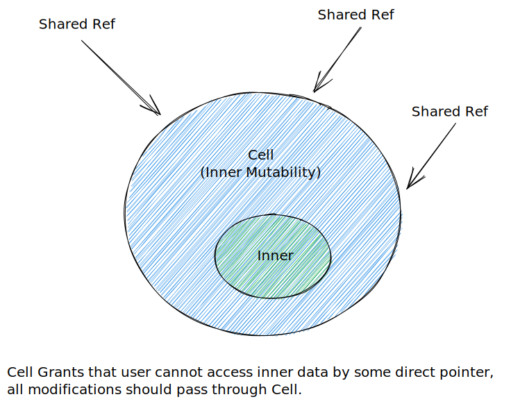

# Rust Practice

## Cell



```rust
impl<T> Cell<T> {
    pub fn get_mut(&mut self) -> &mut T {     }
    pub fn set(&self, val: T) {     }
    pub fn swap(&self, other: &Self) {     }
    pub fn replace(&self, val: T) -> T {     }
    pub fn into_inner(self) -> T {     }
}
impl<T:Copy> Cell<T> {
    pub fn get(&self) -> T {     }
}
```

## RefCell

```rust
    impl<T: ? Sized> RefCell<T> {
        pub fn borrow(&self) -> Ref<T> {     }
        pub fn try_borrow(&self) -> Result<Ref<T>, BorrowError> {     }
        pub fn borrow_mut(&self) -> RefMut<T> {     }
        pub fn try_borrow_mut(&self) -> Result<RefMut<T>, BorrowMutError> {     }
        pub fn get_mut(&mut self) -> &mut T {     }
    }
```
