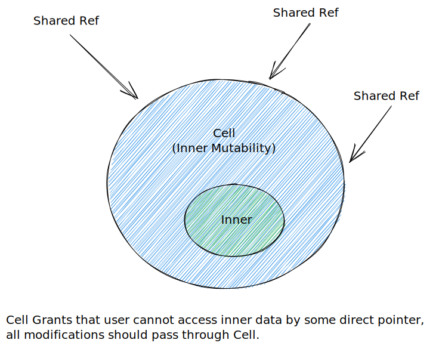

# Rust Practice

## Cell



```rust
impl<T> Cell<T> {
    pub fn get_mut(&mut self) -> &mut T {     }
    pub fn set(&self, val: T) {     }
    pub fn swap(&self, other: &Self) {     }
    pub fn replace(&self, val: T) -> T {     }
    pub fn into_inner(self) -> T {     }
}
impl<T:Copy> Cell<T> {
    pub fn get(&self) -> T {     }
}
```

## RefCell

```rust
    impl<T: ? Sized> RefCell<T> {
        pub fn borrow(&self) -> Ref<T> {     }
        pub fn try_borrow(&self) -> Result<Ref<T>, BorrowError> {     }
        pub fn borrow_mut(&self) -> RefMut<T> {     }
        pub fn try_borrow_mut(&self) -> Result<RefMut<T>, BorrowMutError> {     }
        pub fn get_mut(&mut self) -> &mut T {     }
    }
```

## Tokio

### About the tokio::main

The `#[tokio::main]` function is a macro. It transforms the `async fn main()` into a synchronous `fn main()` that initializes a runtime instance and executes the async main function.

```rust
#[tokio::main]
async fn main() {
    println!("hello");
}

// transformed into ↓
fn main() {
    let mut rt = tokio::runtime::Runtime::new().unwrap();
    rt.block_on(async {
        println!("hello");
    })
}
```

### Send bound

```rust
use tokio::task::yield_not;
use std::rc::Rc;

#[tokio::main]
async fn main() {
    tokio::spawn(async {
        // the scope forces `rc` to drop before `.await`
        {
            let rc = Rc::new("hello");
            println!("{}", rc);
        }
        // `rc` is no longer used. It is **not** persisted when
        // the task yields to the scheduler
        yield_now().await;
    });
}
```

### Shared state

1. Guard the shared state with a Mutex.
2. Spawn a task to manage the state and use message passing to operate on it.

### Message pass

1. `mpsc`: Multi-producer, single consumer channel
2. `oneshot`: single producer, single consumer channel
3. `broadcast`: multi-producer, multi-consumer (Each receiver sees every value)
4. `watch`: single-producer, multi-consumer

```rust
use tokio::sync::mpsc;

#[tokio::main]
async fn main() {
    let (tx, mut rx) = mpsc::channel(32);
    let tx2 = tx.clone();

    tokio::spawn(async move {
        tx.send("sending from first handle").await;
    });

    tokio::spawn(async move {
        tx2.send("sending from second handle").await;
    });

    while let Some(message) = rx.recv().await {
        println!("GOT = {}", message);
    }
}
```

### I/O

- AsyncRead
- AsyncWrite

```rust
use tokio::fs::File;
use tokio::io::{self, AsyncReadExt};

#[tokio::main]
async fn main() -> io::Result<()> {
    let mut f = File::open("foo.txt").await?;
    let mut buffer = [0; 10];

    // read up to 10 bytes
    let n = f.read(&mut buffer[..]).await?;

    // read the whole file util EOF
    f.read_to_end(&mut buffer).await?;

    println!("The bytes: {:?}", &buffer[..n]);
    Ok(())
}
```

```rust
use tokio::io::{self, AsyncWriteExt};
use tokio::fs::File;

#[tokio::main]
async fn main() -> io::Result<()> {
    let mut file = File::create("foo.txt").await?;

    // Writes some prefix of the byte string, but not necessarily all of it.
    let n = file.write(b"some bytes").await?;
    println!("Wrote the first {} bytes of 'some bytes'.", n);

    file.write_all(b"some bytes").await?;
    Ok(())
}
```

**tokio::io::copy**:

```rust
use tokio::fs::File;
use tokio::io;

#[tokio::main]
async fn main() -> io::Result<()> {
    let mut reader: &[u8] = b"hello";
    let mut file = File::create("foo.txt").await?;

    io::copy(&mut reader, &mut file).await?;
    Ok(())
}
```

### Frame

```rust
use bytes::Bytes;

enum Frame {
    Simple(String),
    Error(String),
    Integer(u64),
    Bulk(Bytes),
    Null,
    Array(Vec<Frame>),
}

enum HttpFrame {
    RequestHead {
        method: Method,
        uri: Uri,
        version: Version,
        headers: HeaderMap,
    },
    ResponseHead {
        status: StatusCode,
        version: Version,
        headers: HeaderMap,
    },
    BodyChunk {
        chunk: Bytes,
    },
}
```
